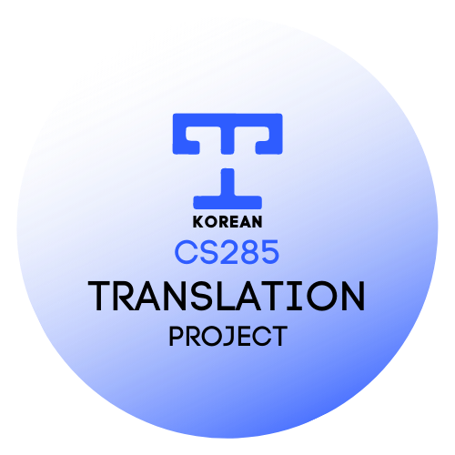

# CS285_21_KOR_SUB 

Korean Sub for CS285 2021 fall lecture

## CS285 한글 번역 프로젝트
### CS285: Deep Reinforcement Learning @UC Berkely
- [Original CS285 Lecture Video Playlist](https://youtube.com/playlist?list=PL_iWQOsE6TfXxKgI1GgyV1B_Xa0DxE5eH)
- [CS285 Website](http://rail.eecs.berkeley.edu/deeprlcourse/) : Slides and Homeworks
- [Instructor and GSIs](http://rail.eecs.berkeley.edu/deeprlcourse/staff/)

## Announcements
Reinforcement Learning 대표 강의인 UC Berkely의 CS285에 한글자막이 있다면 공부하시는 분들에게 도움이 될 것 같아 만든 프로젝트 입니다. 저희의 번역 자막을 이용하실 분들께서는 프로젝트의 [번역 기준](./docs/term.md)을 참고해주시면 감사하겠습니다.

> [CS231n](https://github.com/visionNoob/CS231N_17_KOR_SUB) 프로젝트를 참고하여 많은 도움이 되었습니다. CS231n 한글번역 프로젝트 관계자분들께 감사드립니다.

## How to use it
1. [4K Video Downloader](https://www.4kdownload.com/downloads)로 Youtube에서 강의 링크를 copy&paste하여 영상을 다운 받습니다.
2. repository에 있는 Eng.srt/Kor.srt 파일을 다운 받습니다.
3. 강의 영상을 Eng.srt/Kor.srt 파일과 함께 재생합니다.

## Process
### [✒️:1st Draft](./docs/first_draft.md)
### [🔍:2nd Check](./docs/second_check.md)

## Table of Contents(with Contributors)
- 강의명을 누르면 원본 강의 Youtube 링크가 열립니다.
- 🇺🇸 을 누르면 영어 자막의 srt 파일 링크가 열립니다. Youtube에서 생성된 자동완성 영어 자막을 기반으로 약간의 수정이 들어간 unofficial한 영어 자막입니다.
- 🇰🇷 을 누르면 한글 자막의 srt 파일 링크가 열립니다. 번역 결과물입니다.
- 각 srt 파일 링크에서 라인 번호를 클릭하여 [issue](https://github.com/CS285-KOR-SUB/CS285_21_KOR_SUB/issues)나 [discission](https://github.com/CS285-KOR-SUB/CS285_21_KOR_SUB/discussions)을 남기실 수 있습니다.

> STATUS - ✒️:1st Draft | 🔍:2nd Check

  

  
<b><u>Lecture 01~06</u></b>

      

      
<b>Lecture 01</b>

      
<a href="https://youtu.be/JHrlF10v2Og">L1, Part 1 ✒️</a> 
      <a href="/English_srt/CS%20285%20Lecture%201%2C%20Part%201.srt">🇺🇸</a>
      <a href="/Korean_srt/CS%20285%20Lecture%201%2C%20Part%201.ko.srt">🇰🇷</a>
      

      
<a href="https://youtu.be/IoF7D0qec0I">L1, Part 2 ✒️</a> 
      <a href="/English_srt/CS%20285%20Lecture%201%2C%20Part%202.srt">🇺🇸</a>
      <a href="/Korean_srt/CS%20285%20Lecture%201%2C%20Part%202.ko.srt">🇰🇷</a>
      

      
<a href="https://youtu.be/BYoKE9yRy8g">L1, Part 3 ✒️</a> 
      <a href="/English_srt/CS%20285%20Lecture%201%2C%20Part%203.srt">🇺🇸</a>
      <a href="/Korean_srt/CS%20285%20Lecture%201%2C%20Part%203.ko.srt">🇰🇷</a>
      

      
<a href="https://youtu.be/xRmBEnI55es">L1, Part 4 ✒️</a> 
      <a href="/English_srt/CS%20285%20Lecture%201%2C%20Part%204.srt">🇺🇸</a>
      <a href="/Korean_srt/CS%20285%20Lecture%201%2C%20Part%204.ko.srt">🇰🇷</a>
      

      

      

      
<b>Lecture 02</b>

      
<a href="https://youtu.be/HUzyjOsd2PA">L2, Part 1 ✒️</a> 
      <a href="/English_srt/CS%20285%20Lecture%202%2C%20Part%201.srt">🇺🇸</a>
      <a href="/Korean_srt/CS%20285%20Lecture%202%2C%20Part%201.ko.srt">🇰🇷</a>
      

      
<a href="https://youtu.be/988gLurg01U">L2, Part 2 ✒️</a> 
      <a href="/English_srt/CS%20285%20Lecture%202%2C%20Part%202.srt">🇺🇸</a>
      <a href="/Korean_srt/CS%20285%20Lecture%202%2C%20Part%202.ko.srt">🇰🇷</a>
      

      
<a href="https://youtu.be/H_z7vxGhsQk">L2, Part 3 ✒️</a> 
      <a href="/English_srt/CS%20285%20Lecture%202%2C%20Part%203.srt">🇺🇸</a>
      <a href="/Korean_srt/CS%20285%20Lecture%202%2C%20Part%203.ko.srt">🇰🇷</a>
      

      
<a href="https://youtu.be/ajAaM5FMRz4">L2, Part 4 ✒️</a> 
      <a href="/English_srt/CS%20285%20Lecture%202%2C%20Part%204.srt">🇺🇸</a>
      <a href="/Korean_srt/CS%20285%20Lecture%202%2C%20Part%204.ko.srt">🇰🇷</a>
      

      
<a href="https://youtu.be/e2PpdPC34kI">L2, Part 5 ✒️</a> 
      <a href="/English_srt/CS%20285%20Lecture%202%2C%20Part%205.srt">🇺🇸</a>
      <a href="/Korean_srt/CS%20285%20Lecture%202%2C%20Part%205.ko.srt">🇰🇷</a>
      

      
<a href="https://youtu.be/nM9f-5oQ86Y">L2, Part 6 ✒️</a> 
      <a href="/English_srt/CS%20285%20Lecture%202%2C%20Part%206.srt">🇺🇸</a>
      <a href="/Korean_srt/CS%20285%20Lecture%202%2C%20Part%206.ko.srt">🇰🇷</a>
      

      

      

      
<b>Lecture 03</b>

      
<a href="https://youtu.be/AOypIa_8RXg">L3, Part 1 </a>
      <a href="/English_srt/CS%20285%20Lecture%203%2C%20Part%201.srt">🇺🇸</a>
      <a href="/Korean_srt/CS%20285%20Lecture%203%2C%20Part%201.ko.srt">🇰🇷</a>
      

      
<a href="https://youtu.be/kPa6hU9prg4">L3, Part 2 </a>
      <a href="/English_srt/CS%20285%20Lecture%203%2C%20Part%202.srt">🇺🇸</a>
      <a href="/Korean_srt/CS%20285%20Lecture%203%2C%20Part%202.ko.srt">🇰🇷</a>
      

      
<a href="https://youtu.be/ubSsUJbLkwM">L3, Part 3 </a>
      <a href="/English_srt/CS%20285%20Lecture%203%2C%20Part%203.srt">🇺🇸</a>
      <a href="/Korean_srt/CS%20285%20Lecture%203%2C%20Part%203.ko.srt">🇰🇷</a>
      

      
<a href="https://youtu.be/dsNtkT7LF8M">L3, Part 4 </a>
      <a href="/English_srt/CS%20285%20Lecture%203%2C%20Part%204.srt">🇺🇸</a>
      <a href="/Korean_srt/CS%20285%20Lecture%203%2C%20Part%204.ko.srt">🇰🇷</a>
      

      
<a href="https://youtu.be/Px3dQiv6R7E">L3, Part 5 </a>
      <a href="/English_srt/CS%20285%20Lecture%203%2C%20Part%205.srt">🇺🇸</a>
      <a href="/Korean_srt/CS%20285%20Lecture%203%2C%20Part%205.ko.srt">🇰🇷</a>
      

      

      

      
<b>Lecture 04</b>

      
<a href="https://youtu.be/jds0Wh9jTvE">L4, Part 1 </a>
      <a href="/English_srt/CS%20285%20Lecture%204%2C%20Part%201.srt">🇺🇸</a>
      <a href="/Korean_srt/CS%20285%20Lecture%204%2C%20Part%201.ko.srt">🇰🇷</a>
      

      
<a href="https://youtu.be/Cip5UeGrCEE">L4, Part 2 </a>
      <a href="/English_srt/CS%20285%20Lecture%204%2C%20Part%202.srt">🇺🇸</a>
      <a href="/Korean_srt/CS%20285%20Lecture%204%2C%20Part%202.ko.srt">🇰🇷</a>
      

      
<a href="https://youtu.be/Pua9zO_YmKA">L4, Part 3 </a>
      <a href="/English_srt/CS%20285%20Lecture%204%2C%20Part%203.srt">🇺🇸</a>
      <a href="/Korean_srt/CS%20285%20Lecture%204%2C%20Part%203.ko.srt">🇰🇷</a>
      

      
<a href="https://youtu.be/eG9-F4r5k70">L4, Part 4 </a>
      <a href="/English_srt/CS%20285%20Lecture%204%2C%20Part%204.srt">🇺🇸</a>
      <a href="/Korean_srt/CS%20285%20Lecture%204%2C%20Part%204.ko.srt">🇰🇷</a>
      

      
<a href="https://youtu.be/dFqoGAyofUQ">L4, Part 5 </a>
      <a href="/English_srt/CS%20285%20Lecture%204%2C%20Part%205.srt">🇺🇸</a>
      <a href="/Korean_srt/CS%20285%20Lecture%204%2C%20Part%205.ko.srt">🇰🇷</a>
      

      
<a href="https://youtu.be/hfj9mS3nTLU">L4, Part 6 </a>
      <a href="/English_srt/CS%20285%20Lecture%204%2C%20Part%206.srt">🇺🇸</a>
      <a href="/Korean_srt/CS%20285%20Lecture%204%2C%20Part%206.ko.srt">🇰🇷</a>
      

      

      

      
<b>Lecture 05</b>

      
<a href="https://youtu.be/GKoKNYaBvM0">L5, Part 1 </a>
      <a href="/English_srt/CS%20285%20Lecture%204%2C%20Part%201.srt">🇺🇸</a>
      <a href="/Korean_srt/CS%20285%20Lecture%204%2C%20Part%201.ko.srt">🇰🇷</a>
      

      
<a href="https://youtu.be/VSPYKXm_hMA">L5, Part 2 </a>
      <a href="/English_srt/CS%20285%20Lecture%204%2C%20Part%202.srt">🇺🇸</a>
      <a href="/Korean_srt/CS%20285%20Lecture%204%2C%20Part%202.ko.srt">🇰🇷</a>
      

      
<a href="https://youtu.be/VgdSubQN35g">L5, Part 3 </a>
      <a href="/English_srt/CS%20285%20Lecture%204%2C%20Part%203.srt">🇺🇸</a>
      <a href="/Korean_srt/CS%20285%20Lecture%204%2C%20Part%203.ko.srt">🇰🇷</a>
      

      
<a href="https://youtu.be/KZd508qGFt0">L5, Part 4 </a>
      <a href="/English_srt/CS%20285%20Lecture%204%2C%20Part%204.srt">🇺🇸</a>
      <a href="/Korean_srt/CS%20285%20Lecture%204%2C%20Part%204.ko.srt">🇰🇷</a>
      

      
<a href="https://youtu.be/QRLDAQbWc78">L5, Part 5 </a>
      <a href="/English_srt/CS%20285%20Lecture%204%2C%20Part%205.srt">🇺🇸</a>
      <a href="/Korean_srt/CS%20285%20Lecture%204%2C%20Part%205.ko.srt">🇰🇷</a>
      

      
<a href="https://youtu.be/PEzuojy8lVo">L5, Part 6 </a>
      <a href="/English_srt/CS%20285%20Lecture%204%2C%20Part%206.srt">🇺🇸</a>
      <a href="/Korean_srt/CS%20285%20Lecture%204%2C%20Part%206.ko.srt">🇰🇷</a>
      

      

      

      
<b>Lecture 06</b>

      
<a href="https://youtu.be/wr00ef_TY6Q">L6, Part 1 </a>
      <a href="/English_srt/CS%20285%20Lecture%205%2C%20Part%201.srt">🇺🇸</a>
      <a href="/Korean_srt/CS%20285%20Lecture%205%2C%20Part%201.ko.srt">🇰🇷</a>
      

      
<a href="https://youtu.be/KVHtuwVhULA">L6, Part 2 </a>
      <a href="/English_srt/CS%20285%20Lecture%205%2C%20Part%202.srt">🇺🇸</a>
      <a href="/Korean_srt/CS%20285%20Lecture%205%2C%20Part%202.ko.srt">🇰🇷</a>
      

      
<a href="https://youtu.be/7C2DSdXX-kQ">L6, Part 3 </a>
      <a href="/English_srt/CS%20285%20Lecture%205%2C%20Part%203.srt">🇺🇸</a>
      <a href="/Korean_srt/CS%20285%20Lecture%205%2C%20Part%203.ko.srt">🇰🇷</a>
      

      
<a href="https://youtu.be/quRjnkj-MA0">L6, Part 4 </a>
      <a href="/English_srt/CS%20285%20Lecture%205%2C%20Part%204.srt">🇺🇸</a>
      <a href="/Korean_srt/CS%20285%20Lecture%205%2C%20Part%204.ko.srt">🇰🇷</a>
      

      
<a href="https://youtu.be/A99gFMZPw7w">L6, Part 5 </a>
      <a href="/English_srt/CS%20285%20Lecture%205%2C%20Part%205.srt">🇺🇸</a>
      <a href="/Korean_srt/CS%20285%20Lecture%205%2C%20Part%205.ko.srt">🇰🇷</a>
      

      
    
  

  
  
  

  
<b><u>Lecture 07~12</u></b>

     

      
<b>Lecture 07</b>

      
<a href="https://youtu.be/pP_67mTJbGw">L7, Part 1 </a>
      <a href="/English_srt/CS%20285%20Lecture%206%2C%20Part%201.srt">🇺🇸</a>
      <a href="/Korean_srt/CS%20285%20Lecture%206%2C%20Part%201.ko.srt">🇰🇷</a>
      

      
<a href="https://youtu.be/QUbuBEY12u0">L7, Part 2 </a>
      <a href="/English_srt/CS%20285%20Lecture%206%2C%20Part%202.srt">🇺🇸</a>
      <a href="/Korean_srt/CS%20285%20Lecture%206%2C%20Part%202.ko.srt">🇰🇷</a>
      

      
<a href="https://youtu.be/Mz7XweEMCVI">L7, Part 3 </a>
      <a href="/English_srt/CS%20285%20Lecture%206%2C%20Part%203.srt">🇺🇸</a>
      <a href="/Korean_srt/CS%20285%20Lecture%206%2C%20Part%203.ko.srt">🇰🇷</a>
      

      
<a href="https://youtu.be/9bOurz4aCbA">L7, Part 4 </a>
      <a href="/English_srt/CS%20285%20Lecture%206%2C%20Part%204.srt">🇺🇸</a>
      <a href="/Korean_srt/CS%20285%20Lecture%206%2C%20Part%204.ko.srt">🇰🇷</a>
      

      

      

      
<b>Lecture 08</b>

      
<a href="https://youtu.be/7-D8RL3D6CI">L8, Part 1 </a>
      <a href="/English_srt/CS%20285%20Lecture%207%2C%20Part%201.srt">🇺🇸</a>
      <a href="/Korean_srt/CS%20285%20Lecture%207%2C%20Part%201.ko.srt">🇰🇷</a>
      

      
<a href="https://youtu.be/lqC9w532erw">L8, Part 2 </a>
      <a href="/English_srt/CS%20285%20Lecture%207%2C%20Part%202.srt">🇺🇸</a>
      <a href="/Korean_srt/CS%20285%20Lecture%207%2C%20Part%202.ko.srt">🇰🇷</a>
      

      
<a href="https://youtu.be/oKfUMzfpAw0">L8, Part 3 </a>
      <a href="/English_srt/CS%20285%20Lecture%207%2C%20Part%203.srt">🇺🇸</a>
      <a href="/Korean_srt/CS%20285%20Lecture%207%2C%20Part%203.ko.srt">🇰🇷</a>
      

      
<a href="https://youtu.be/oMUSn1eRm7A">L8, Part 4 </a>
      <a href="/English_srt/CS%20285%20Lecture%207%2C%20Part%204.srt">🇺🇸</a>
      <a href="/Korean_srt/CS%20285%20Lecture%207%2C%20Part%204.ko.srt">🇰🇷</a>
      

      
<a href="https://youtu.be/Q-Qwjz8Zmh0">L8, Part 5 </a>
      <a href="/English_srt/CS%20285%20Lecture%207%2C%20Part%204.srt">🇺🇸</a>
      <a href="/Korean_srt/CS%20285%20Lecture%207%2C%20Part%204.ko.srt">🇰🇷</a>
      

      
<a href="https://youtu.be/cmGSnu-PIwU">L8, Part 6 </a>
      <a href="/English_srt/CS%20285%20Lecture%207%2C%20Part%204.srt">🇺🇸</a>
      <a href="/Korean_srt/CS%20285%20Lecture%207%2C%20Part%204.ko.srt">🇰🇷</a>
      

      

      

      
<b>Lecture 09</b>

      
<a href="https://youtu.be/ySenCHPsKJU">L9, Part 1 </a>
      <a href="/English_srt/CS%20285%20Lecture%208%2C%20Part%201.srt">🇺🇸</a>
      <a href="/Korean_srt/CS%20285%20Lecture%208%2C%20Part%201.ko.srt">🇰🇷</a>
      

      
<a href="https://youtu.be/LtAt5M_a0dI">L9, Part 2 </a>
      <a href="/English_srt/CS%20285%20Lecture%208%2C%20Part%202.srt">🇺🇸</a>
      <a href="/Korean_srt/CS%20285%20Lecture%208%2C%20Part%202.ko.srt">🇰🇷</a>
      

      
<a href="https://youtu.be/WuPauZgX7BM">L9, Part 3 </a>
      <a href="/English_srt/CS%20285%20Lecture%208%2C%20Part%203.srt">🇺🇸</a>
      <a href="/Korean_srt/CS%20285%20Lecture%208%2C%20Part%203.ko.srt">🇰🇷</a>
      

      
<a href="https://youtu.be/QWnpF0FaKL4">L9, Part 4 </a>
      <a href="/English_srt/CS%20285%20Lecture%208%2C%20Part%204.srt">🇺🇸</a>
      <a href="/Korean_srt/CS%20285%20Lecture%208%2C%20Part%204.ko.srt">🇰🇷</a>
      

      

      

      
<b>Lecture 10</b>

      
<a href="https://youtu.be/4SL0DnxC1GM">L10, Part 1 </a>
      <a href="/English_srt/CS%20285%20Lecture%209%2C%20Part%201.srt">🇺🇸</a>
      <a href="/Korean_srt/CS%20285%20Lecture%209%2C%20Part%201.ko.srt">🇰🇷</a>
      

      
<a href="https://youtu.be/pd9mKcH4kkk">L10, Part 2 </a>
      <a href="/English_srt/CS%20285%20Lecture%209%2C%20Part%202.srt">🇺🇸</a>
      <a href="/Korean_srt/CS%20285%20Lecture%209%2C%20Part%202.ko.srt">🇰🇷</a>
      

      
<a href="https://youtu.be/gqTE8-tH3Iw">L10, Part 3 </a>
      <a href="/English_srt/CS%20285%20Lecture%209%2C%20Part%203.srt">🇺🇸</a>
      <a href="/Korean_srt/CS%20285%20Lecture%209%2C%20Part%203.ko.srt">🇰🇷</a>
      

      
<a href="https://youtu.be/PHC2dm4E_VQ">L10, Part 4 </a>
      <a href="/English_srt/CS%20285%20Lecture%209%2C%20Part%204.srt">🇺🇸</a>
      <a href="/Korean_srt/CS%20285%20Lecture%209%2C%20Part%204.ko.srt">🇰🇷</a>
      

      
<a href="https://youtu.be/4Km05TctgNw">L10, Part 5 </a>
      <a href="/English_srt/CS%20285%20Lecture%209%2C%20Part%204.srt">🇺🇸</a>
      <a href="/Korean_srt/CS%20285%20Lecture%209%2C%20Part%204.ko.srt">🇰🇷</a>
      

      

      

      
<b>Lecture 11</b>

      

      tba
      

      

      

      
<b>Lecture 12</b>

      

      tba
      

      
    
  

  
  

  
<b><u>Lecture 13~18</u></b>

      

      
<b>Lecture 13</b>

      

      tba
      

      

      

      
<b>Lecture 14</b>

      

      tba
      

      

      

      
<b>Lecture 15</b>

      

      tba
      

      

      

      
<b>Lecture 16</b>

      

      tba
      

      

      

      
<b>Lecture 17</b>

      

      tba
      

      

      

      
<b>Lecture 18</b>

      

      tba
      

      
    
  

  
  

  
<b><u>Lecture 19~23</u></b>

      

      
<b>Lecture 19</b>

      

      tba
      

      

      

      
<b>Lecture 20</b>

      

      tba
      

      

      

      
<b>Lecture 21</b>

      

      tba
      

      

      

      
<b>Lecture 22</b>

      

      tba
      

      

      

      
<b>Lecture 23</b>

      

      tba
      

      

  

  
  

  
<b><u>Guest Talk</u></b>

      

      
<b>Mid Toggle</b>

      

      tba
      

      

      

      
<b>Mid Toggle</b>

      

      tba
      

      

      

      
<b>Mid Toggle</b>

      

      tba
      

      

      

      
<b>Mid Toggle</b>

      

      tba
      

      

  

### Contributors
You can check contributors [here](https://github.com/CS285-KOR-SUB/CS285_21_KOR_SUB/graphs/contributors).

## Contact
오역과 오타에 관해서는 [Issue](https://github.com/CS285-KOR-SUB/CS285_21_KOR_SUB/issues)나 [Pull request](https://github.com/CS285-KOR-SUB/CS285_21_KOR_SUB/pulls)로 함께 번역의 질을 높여주시는 데 도움을 주시면 감사하겠습니다.

📧 curieuexjy@gmail.com
