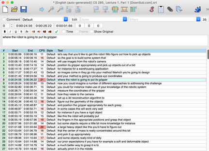
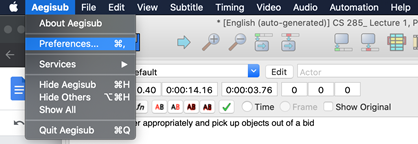
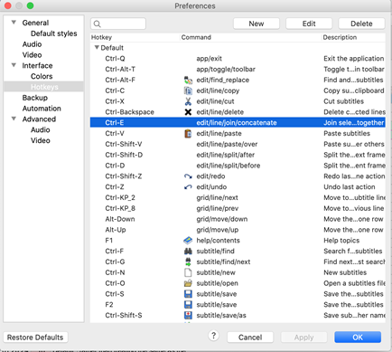
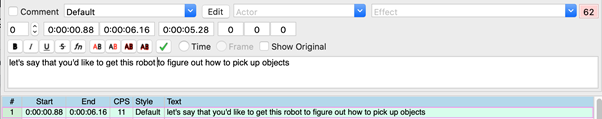
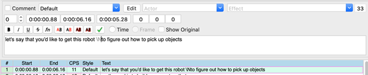

# Aegisub을 활용한 작업 튜토리얼(Mac)

1. https://savesubs.com/ko 에서 srt 파일 다운로드
2. http://plorkyeran.com/aegisub/ 에서 Aegisub 설치 파일 다운로드 및 설치
3. Aegisub에서 srt 파일 열기 & 작업 진행

4. 작업 완료 후 srt 파일 업로드

## Tips

1. 자막 단위 합치기 단축키 지정

작업을 하다보니 Join lines > Concatenate 기능(자막 단위 여러 개를 하나로 합치는 기능)을 자주 쓰게 되더라구요. 원래는 단축키로 지원하지 않는 기능인데, 커스텀 단축키를 만들어서 사용할 수 있습니다. 이를 위해 Preference 창을 열고 Interface > Hotkeys 를 선택합니다.

그 후 Default Hotkeys 목록을 열고, 여기에 New를 눌러서 새로운 Hotkey를 만들고 Edit을 눌러서 단축키는 Ctrl-E(다른 걸로 해도 됩니다만 이미 지정된 키도 아니고 누르기 편한 게 이거였네요)를 해주고 Command에는 edit/line/join/concatenate를 써준 뒤 아래 Apply / OK를 눌러주면 커스텀 단축키가 적용됩니다.

2. CPS

시간초 옆에 있는 CPS라는 숫자는 시간당 나오는 글자 수라고 합니다. 시간이 짧은데 너무 많은 글자들이 나올수록 가독성이 안 좋다고 빨간색이 진해집니다. CPS가 너무 커진다 싶으면 자막 시간을 늘려주거나 글자를 다른 문장으로 옮겨서 조정해주면 좋습니다.

3. 문장 나누기 escape character \N 추가

Text에서 문장이 길어진다 싶으면 자막을 2줄로 나누어 가독성을 높일 수 있습니다. 편집 화면에서 줄을 나누고 싶은 부분에 커서를 두고 Shift+Enter를 누르면 escape character \N이 추가되고, 일반 텍스트 편집기에서 확인하면 2줄로 나누어집니다.

