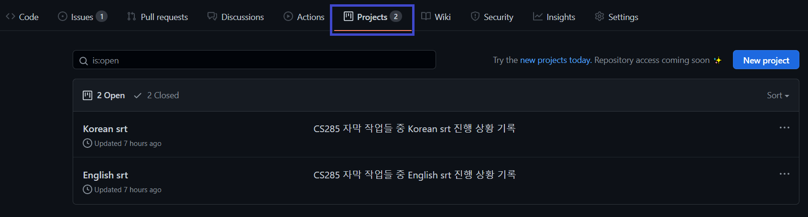
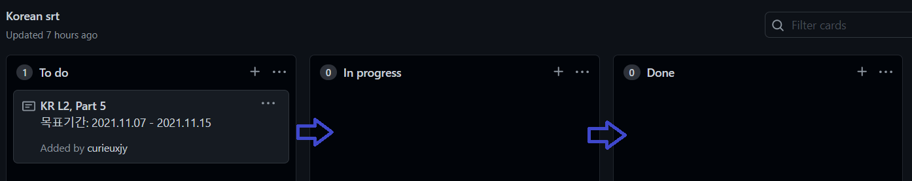
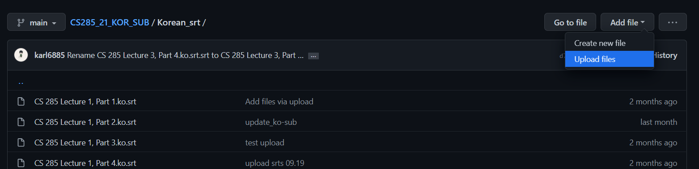
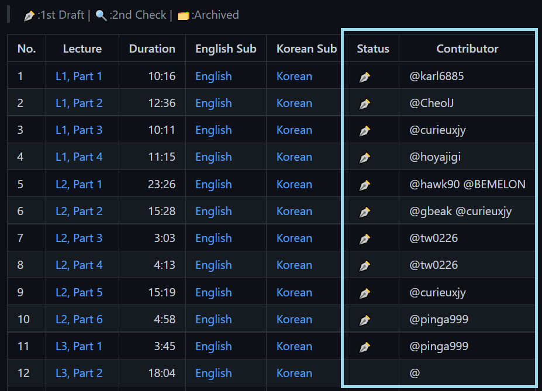

# 번역 작업 방법 설명(1st Draft)

> 번역 작업을 시작하기 위해 작업 동영상 선정 및 1차 번역 작업물인 srt 파일 업로드까지를 안내합니다.

## 1. 번역 작업 동영상 선정하기

Github Repository에 있는 [Projects](https://docs.github.com/en/issues/organizing-your-work-with-project-boards/managing-project-boards/about-project-boards)를 활용하여 작업할 동영상 강의 선정과 기간을 세웁니다.

`Projects`에는 영어 자막 작업을 위한 `English srt`와 한글 자막 작업을 위한 `Korean srt`프로젝트 2개가 있습니다. 메인 Markdown 파일인 [README.md](https://github.com/CS285-KOR-SUB/CS285_21_KOR_SUB#table-of-contentswith-contributors)강의 리스트에서 작업이 완료되지 않은 강의를 선정하여 프로젝트 보드에 Card를 만듭니다.



작업할 자막 언어에 따라 `English srt` 혹은 `Korean srt` 프로젝트를 클릭합니다. `To do`/`In Progress`/`Done` 총 3가지 작업 분류 열이 있습니다.
- `To do` : 작업 대기. 아직 작업자 배정 안됨.
- `In Progress` : 작업 중
- `Done` : 1차 자막 작업 완료 후, 깃헙에 업로드 된 작업

이 중 `To do`에 있는 강의에서 카드를 확인하고 목표기간을 써서 `In Progress`로 옮겨서 작업을 시작합니다.

- 프로젝트 구분이 되어 있지만 혼동 방지를 위해 카드 제목에 `KR`, `ENG`를 기록하고 강의 이름을 적습니다.
- 목표기간은 최대한 맞추기 위해 스케줄을 고려하여 정해주세요.
- 1카드 당 목표(실행)기간은 최대 2주 입니다.
- 카드 생성시 생성자의 Gitnub nickname이 기록되므로 따로 담당자의 이름은 적지 않습니다.

> 작업 카드 예시
```
**KR L2, Part 5**
목표기간: 2021.11.07 - 2021.11.15
```

```
**ENG L2, Part 5**
목표기간: 2021.11.07 - 2021.11.15
```




## 2. 번역 작업 툴을 활용하여 번역하기

작업 환경 OS에 따라 더 편하거나 오류가 없는 번역 툴이 있기 때문에 CS285 프로젝트에서는 Mac에서는 Aegisub를, Windows에서는 Subtitle Edit 프로그램을 권장합니다. 자막의 싱크를 맞출 수 있고 srt 파일 확장자로 저장할 수 있는 어떤 프로그램이든 사용 가능합니다. 

[](./aegisub.md)
[](./subtitle_edit.md)

> Aegisub Tutorial Thanks to @karl6885

> Subtitle Edit Tutorial Thanks to @curieuxjy

각자 작업환경에 맞는 프로그램을 이용하여 진행해주세요.

## 3. 번역 작업 후 자막 파일 업로드

작업을 완료한 후에는 Github에 srt 파일을 업로드 합니다. 



업로드 한 후에는 [README](https://github.com/CS285-KOR-SUB/CS285_21_KOR_SUB#table-of-contentswith-contributors)에 `Status` 및 `Contributor` 태그를 작성합니다.
- `Status` : 1st Draft, 2nd Check인지에 따라 표시
- `Contributor` : Github ID로 태그



## 4. 번역 작업 완료 마무리

`1.`에서 선정했던 작업카드를 `Done` 칼럼으로 옮겨서 마무리 합니다. 목표 기간과 실행 기간의 차이는 있을 수 있습니다.

