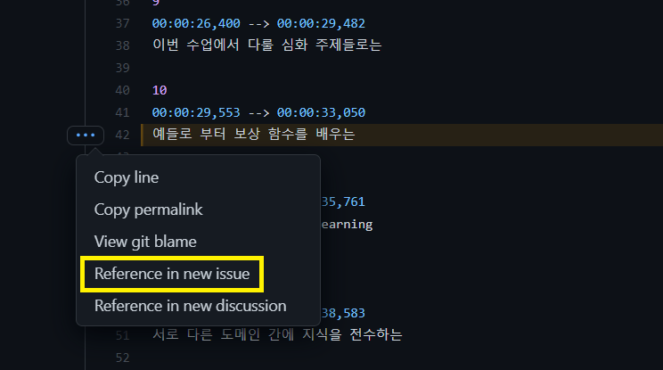
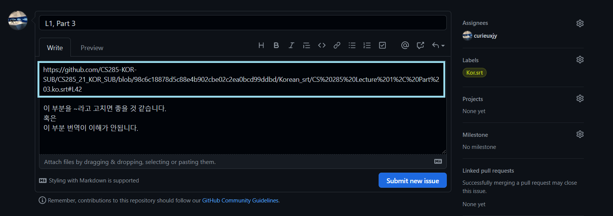
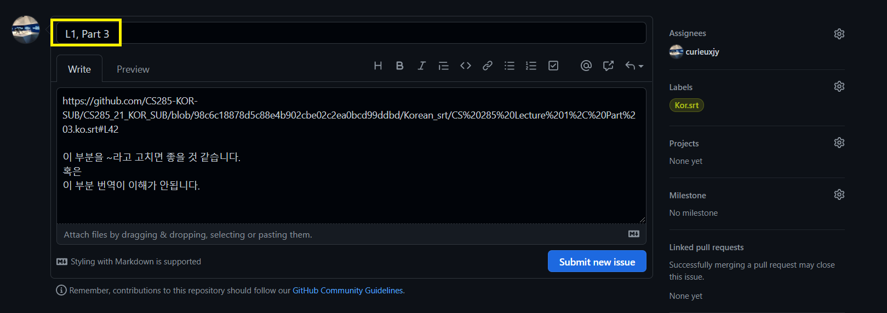
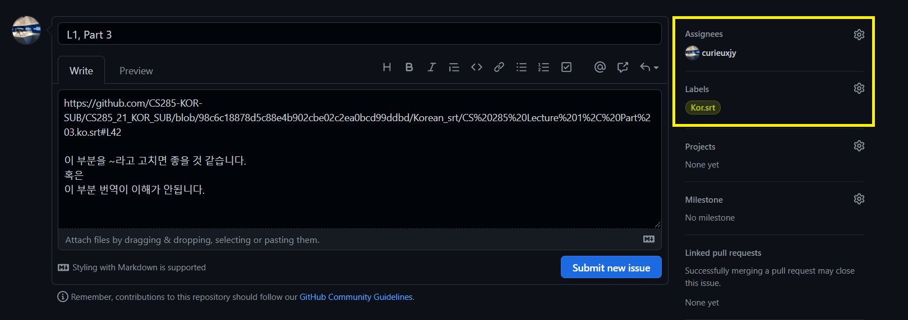

# 퇴고 작업 방법 설명(2nd Check)

> Github Issues를 통해 퇴고를 하는 과정을 안내합니다.

1.	Github에 업로드 된 자막을 다운 받아 시청 합니다. (https://github.com/CS285-KOR-SUB/CS285_21_KOR_SUB)

2.	어색하거나 논의하고 싶은 부분을 찾으면, Github의 해당 파일의 라인의 왼쪽 번호를 클릭합니다. (사진에서는 `42`을 클릭) `…` 표시를 누르고 `Reference in new issue`를 클릭합니다.

3. 래퍼런스를 달아서 이슈를 작성합니다. 

    래퍼런스를 달게 되면 이 부분이 자동으로 작성됩니다.

4. 제목은 퇴고하는 강의 제목으로 해주세요. 예) `L1, Part 3`

5. 해당 강의를 작업한 Contributor를 `Asignees`에 태그하고, 한글 자막에 대한 퇴고 이면 `Kor.srt`를 영어 자막에 대한 퇴고이면 `Eng.srt`를 달아주세요.

6. 퇴고에 대한 Contribution은 1차 작업때와 같이 [README](https://github.com/CS285-KOR-SUB/CS285_21_KOR_SUB#table-of-contentswith-contributors)에 2nd Check 표시와 함께 Contributor에 태그해주세요.