# Subtitle Edit을 활용한 작업 튜토리얼(Windows)

1.	https://www.nikse.dk/ Subtitle Edit 3.6.2 Download 및 (Unzip 후) 설치

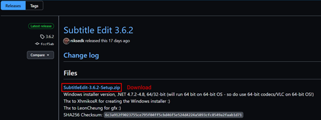

2.	강의 리스트중에서 작업할 동영상 공유링크 복사(2번 사용할 예정)

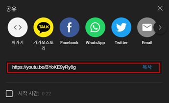

3.	4K downloader로 동영상 다운로드

> 4K downloader 프로그램이 없다면 설치해주세요.
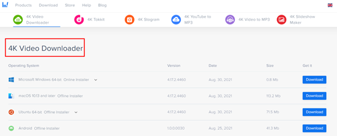

4K downloader 실행 후, `2.`에서 복사한 공유링크를 Paste Link를 눌러 붙여넣기해서 해당 강의 동영상 다운로드

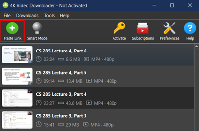

4.	https://savesubs.com/ko 에서 srt 자막 파일 다운로드

`2.`에서 복사한 공유링크를 붙여넣기해서 해당 강의의 srt 자막 다운로드

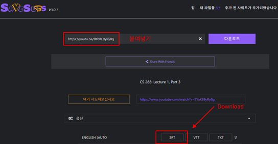

5.	Subtitle Edit 실행 후 상단의 File-Open(Ctrl+O)을 눌러 srt 자막파일 열기

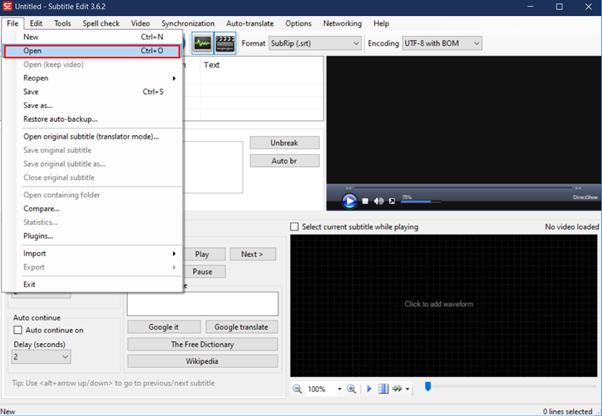

6.	상단의 Video-Open video file을 눌러 동영상 파일 열기

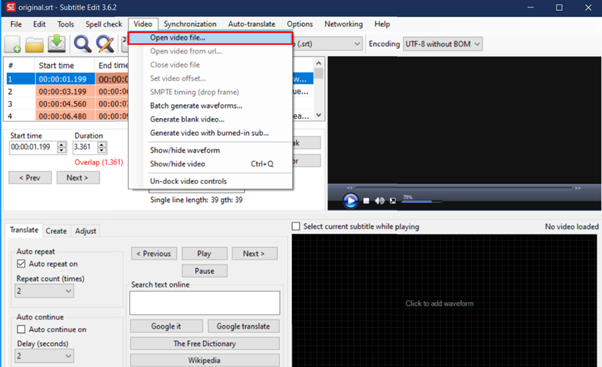

자막과 영상 모두 불러와진 상태

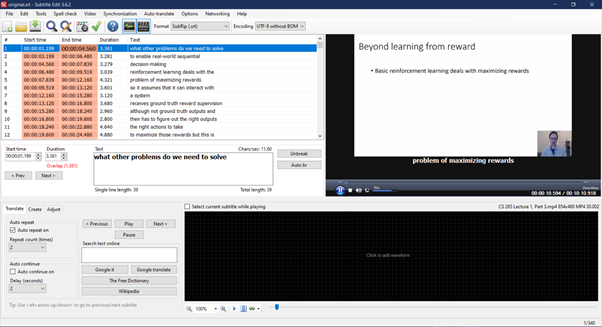

## Tips

1.	Waveform

영상의 음성 waveform을 보고 보다 정확한 타이밍을 찾기 위해 VLC Media Player를 설치 http://www.videolan.org/ 한후, Subtitle Edit 프로그램 창 하단의 “Click to add waveform” 클릭

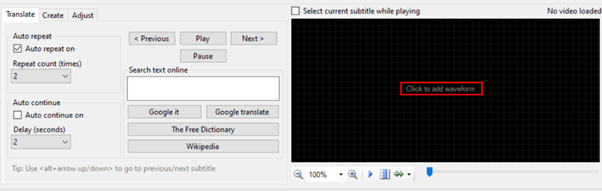

음성 waveform까지 불러와진 상태 입니다. waveform 창의 상단에는 자막이 보이고 아래는 time 이 표시됩니다.

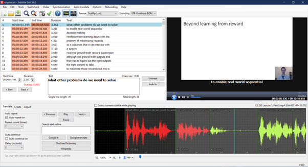

오디오를 사용하면 자막 싱크 맞추기가 편합니다.

오디오 창에서 각 자막의 start time과 end time을 드래그해서 조절 가능합니다! 

(왼쪽 자막 편집 창에서 편집하려는 자막라인을 더블 클릭 후, 해당 섹션으로 이동 - 마우스로 스타트 라인이나 앤드 라인을 드래그 해서 이동 가능) 

섹션이 겹쳐서 잘 선택이 안될 경우 Duration을 조금 짧게 일부러 잡아서 겹치지 않게 하고 라인을 움직여보세요.

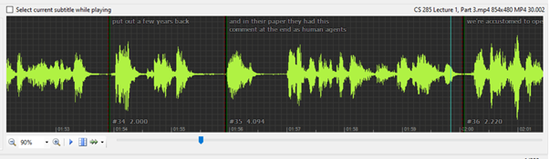

2.	Custom Shortcuts
상단의 Options-Settings 를 누르면 Shortcuts 편집이 가능합니다. 
(저도 사용해본 프로그램이 아니라서 어떤 키가 유용할지는 아직 잘 모르겠네요.)
default 병합 키 Ctrl+Shift+M

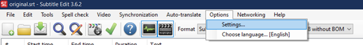

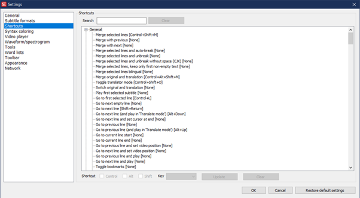

3.	Translation (auto)
Options-Settings-Tools에 Google translate API Key를 입력 후
(그런데 사실 API 없이도 번역이 가능하긴 하지만 퀄리티가 떨어집니다.)

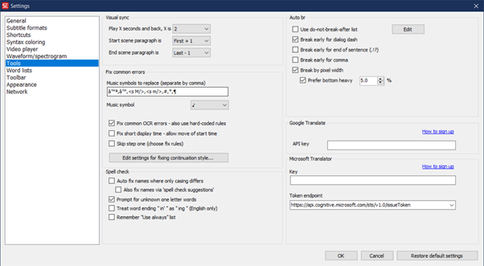

상단의 메뉴 Auto-translate - Auto-translate 로 자동번역 사용

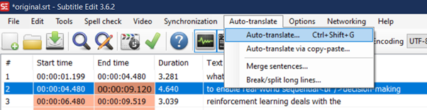

Translate된 모습

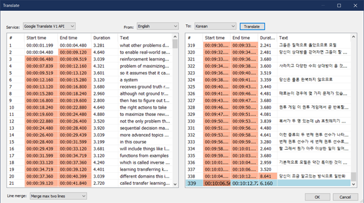

OK를 누르면 original text와 함께 보여지는 상태로 바뀝니다.

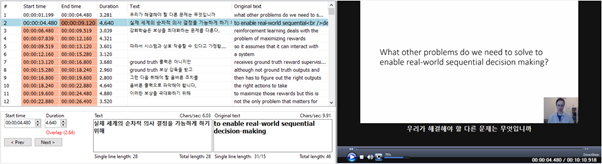

## Reference

-	https://nikse.dk/SubtitleEdit/Help 
-	https://youtu.be/9_nlYd-PDPs
-	https://m.blog.naver.com/siwoo9999/220244667206 
